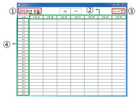
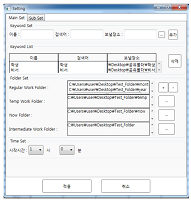

# Auto_File_Transfer
> 학부생 3학년 1학기 때 건양대 정형외과 소속 교수로부터 의뢰 받아 개발한 자동파일전송프로그램

## 개발기간
* 2019.05.07.~2019.08.19. (약3개월)

## 주요기능
* 정해진 시간에 지정된 폴더로 지정된 파일들을 전송

## Development setup
* OS: Window7,10
* Framework: .Net

## Release History

* 1.0.0
    * first
    * 개발 완료

## Contact

김준혁 – kimjunhyeok.it@gmail.com
